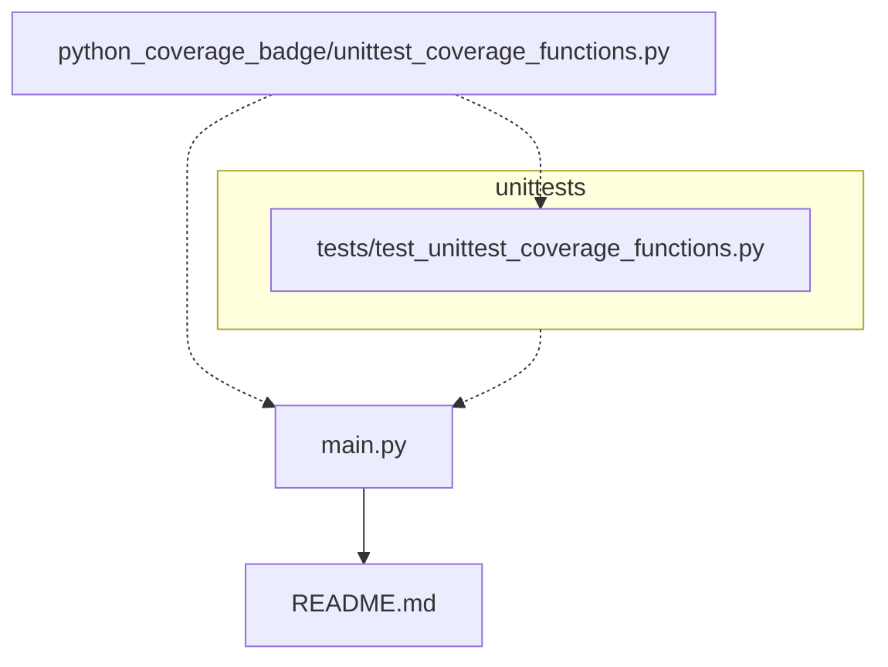

[](https://github.com/psf/black)


# python_coverage_badge
A package to create and maintain a package unit test coverage badge in python code README. Importantly there are quite a few python packages that do this task or similar:
- [`genbadge`](https://smarie.github.io/python-genbadge/) - generates badges (as images) for a range of python tools including a coverage one
- [`coverage-badge`](https://pypi.org/project/coverage-badge/) - generates badge as image
- [`readme-coverage-badger`](https://pypi.org/project/readme-coverage-badger/) - adds coverage badge to README if you have already run tests

I created the `python_coverage_badge` package mainly as a learning exercise for myself but also to have a tool that runs my tests and updates a coverage badge in one go.

It works by first running the [`coverage`](https://coverage.readthedocs.io/) python package to generate a coverage report and puts the result into a structure url using the [shields.io](https://shields.io/) service. For example, the `average_coverage` and `badge_colour` variables can be fed into this url structure:
```
https://img.shields.io/badge/coverage-{average_coverage}%25-{badge_colour}
```

# Tasks

- TODO Update this README and simplify setup content below
- TODO Add workflow diagram
- TODO Add doctree
- TODO Add number of tests badge

# Updating coverage badge 🦡
To update the coverage badge of this README run:
```python
python main.py
```
> Note must be ran from repository root as shown in above codeblock

# Install `python_coverage_badge` 🦡
Clone the repository with (or similar):
```bash
git clone https://github.com/JosephCrispell/timesheet.git
```

And install by running this in repository:
```bash
pip install -e .
```
> Note the `-e` in above means the package will automatically update as you change the codebase.

# For Developers
## `precommit` installation ✔

Install python [`pre-commit`](https://pre-commit.com/) with:
```bash
pip install pre-commit
```

Within repository folder run:
```bash
pre-commit install
```

## Running tests 🧪
[Unit tests](https://realpython.com/python-testing/) (using the [`unittest`](https://docs.python.org/3/library/unittest.html) package) are in `tests/` can be ran with.

To run all tests together:
```bash
python -m unittest
```

## Workflow
I created the following simple diagram using [mermaid](https://mermaid.js.org/) to show how the code and outputs link together.


