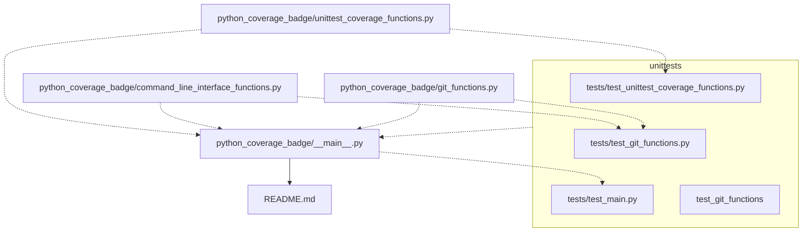

[](https://github.com/psf/black)


# python_coverage_badge
A package to create and maintain a package unit test coverage badge in python code README. Importantly there are quite a few python packages that do this task or similar:
- [`genbadge`](https://smarie.github.io/python-genbadge/) - generates badges (as images) for a range of python tools including a coverage one
- [`coverage-badge`](https://pypi.org/project/coverage-badge/) - generates badge as image
- [`readme-coverage-badger`](https://pypi.org/project/readme-coverage-badger/) - adds coverage badge to README if you have already run tests

I created the `python_coverage_badge` package mainly as a learning exercise for myself but also to have a tool that runs my tests and updates a coverage badge in one go.

It works by first running the [`coverage`](https://coverage.readthedocs.io/) python package to generate a coverage report and puts the result into a structure url using the [shields.io](https://shields.io/) service. For example, the `average_coverage` and `badge_colour` variables can be fed into this url structure:
```
https://img.shields.io/badge/coverage-{average_coverage}%25-{badge_colour}
```

# Tasks

- TODO Add tests for git functions
- TODO Add tests for main

# Installing `python_coverage_badge` 📦
To install this package, follow these two steps:
1. Clone the repository with (or something similar): `git clone https://github.com/JosephCrispell/python_coverage_badge.git`
2. Navigate to the repository and install with: `pip install .`

# Updating coverage badge 🔃
To update the coverage badge of your repo, run the following from within the **root** folder of your repository:
```bash
python -m python_coverage_badge
```

There are a couple of command line arguments you can use, take a look with `python -m python_coverage_badge`:
```
usage: python_coverage_badge [-h] [-d [directory]] [-r [readme_path]]

Welcome to python_coverage_badge! A tool to create and maintain a python package unit test coverage badge in README.md

options:
  -h, --help  show this help message and exit
  -d [directory], --directory [directory]
              Provide path to directory to run python_coverage_badge in. (default: .)
  -r [readme_path], --readme [readme_path]
              Provide path to README.md relative to directory provided. (default: README.md)
```

# For Developers

## Installation for development
As [above](#updating-coverage-badge-🔃) to install clone the repo but run `pip install -e .`. The `-e` flag means the package will automatically update as you change the codebase.

## Package structure
Directory tree generated using [file-tree-generator](https://marketplace.visualstudio.com/items?itemName=Shinotatwu-DS.file-tree-generator) Visual Studio Code extension:

```
📦python_coverage_badge
 ┣ 📂python_coverage_badge
 ┃ ┣ 📜__main__.py # script that is called when you call package (python -m python_coverage_badge)
 ┃ ┣ 📜command_line_interface_functions.py # functions for the command line interface
 ┃ ┣ 📜git_functions.py # functions to staging, committing, and pushing updated README to remote
 ┃ ┣ 📜unittest_coverage_functions.py # functions to calculate coverage and update badge
 ┃ ┗ 📜__init__.py
 ┣ 📂tests
 ┃ ┣ 📜test_command_line_interface_functions.py # unit tests for cli
 ┃ ┣ 📜test_git_functions.py # unit tests for git functions
 ┃ ┣ 📜test_main.py # unit tests for main script
 ┃ ┣ 📜test_unittest_coverage_functions.py # unit tests for functions to create/update coverage badge
 ┃ ┗ 📜__init__.py
 ┣ 📜.gitignore
 ┣ 📜.pre-commit-config.yaml # precommit workflow
 ┣ 📜LICENSE
 ┣ 📜README.md
 ┣ 📜requirements.txt
 ┗ 📜setup.py
```

## `precommit` installation ✔

Install python [`pre-commit`](https://pre-commit.com/) with:
```bash
pip install pre-commit
```

Within repository folder run:
```bash
pre-commit install
```

## Running tests 🧪
[Unit tests](https://realpython.com/python-testing/) (using the [`unittest`](https://docs.python.org/3/library/unittest.html) package) are in `tests/` can be ran all together with:
```bash
python -m unittest
```

## Workflow ➡
I created the following simple diagram using [mermaid](https://mermaid.js.org/) to show how the code and outputs link together.


